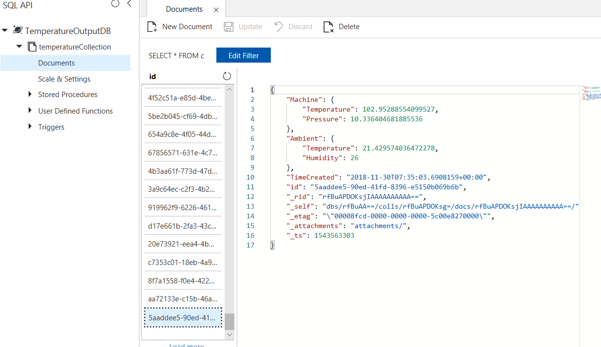

# toAzureEventsHubCosmosDB
## Goal
To send the filtered temperature sensor module output to cosmossDB 
## Development Language 
 C#
## Refered from 
1. Pluralsight course
2. https://docs.microsoft.com/en-us/azure/cosmos-db/create-sql-api-dotnet 

## CosmossDB

The filtered data is pushed to DB

